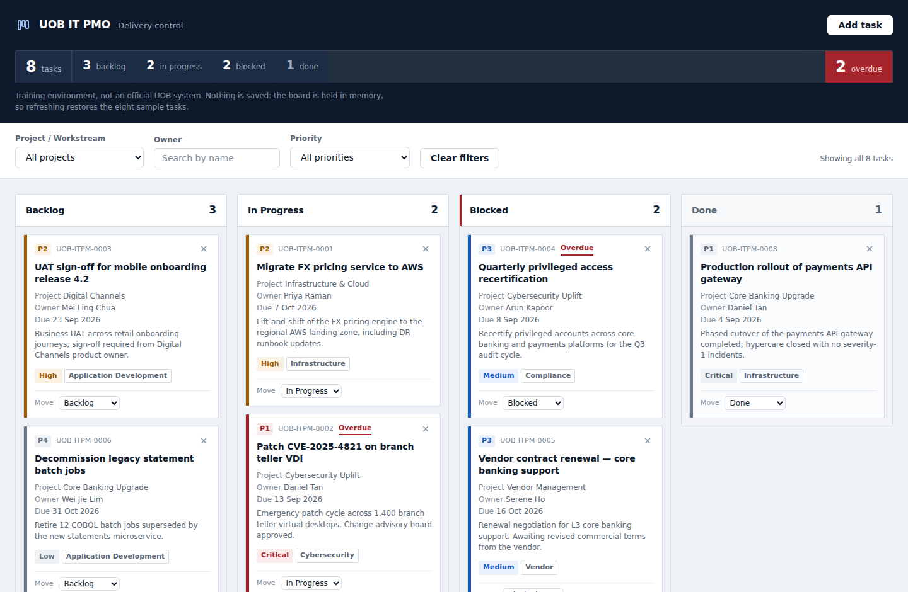
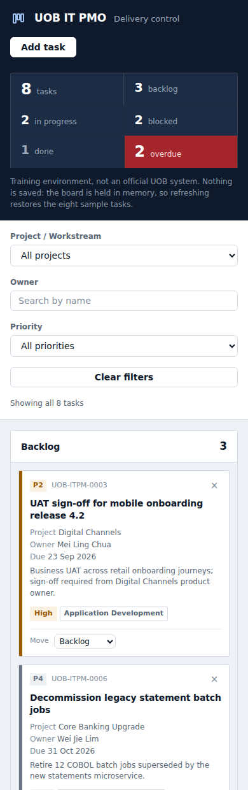

# UOB IT PMO — Project Kanban

A single-file Kanban board for tracking IT project tasks across four statuses, built as an
internal **demo and training tool**.

**Live: https://jonbowden.github.io/kanban1/**

> **Not an official UOB system.** This is a training exercise. It uses a plain "UOB IT PMO"
> text wordmark and a generic corporate blue palette — no UOB logo, trademark, or branding,
> and it does not reproduce or connect to any real UOB system. All task data is invented.



<details>
<summary>On a phone (390px) — columns stack</summary>



</details>

---

## Running it

Open `index.html` — double-click the file, or drag it into a browser. That is the whole
process. There is no server, no build step, no dependency install, and no npm.

The live link above serves the same file over HTTPS.

## What it does

- **Four columns** — Backlog, In Progress, Blocked, Done — side by side on desktop, stacked
  below 768px, each with a live count badge.
- **Drag and drop** cards between columns using the native HTML5 API, with a drop-target
  highlight on the column you are over.
- **Keyboard equivalent** — every card carries a `Move ▸` control, so the board is fully
  operable without a mouse. Drag-and-drop is mouse-only, so this is the accessible path,
  not a convenience.
- **Cards** show a severity code (P1-P4), task ID, title, project, owner, due date and
  category. Priority reads three ways — the spine colour, the code, and the written word —
  so colour is never the only signal. Overdue tasks (due date passed, not yet Done) are
  flagged. Finished work is deliberately muted: a closed task should not signal risk.
- **Add Task** modal with inline validation — no `alert()`, no `confirm()`. Deleting a card
  uses an inline `Delete? Yes / No` row inside the card itself.
- **Filters** by project, assignee (case-insensitive contains) and priority, plus a live
  summary strip showing totals per status and the overdue count.
- **Email notification** on new tasks via FormSubmit, sent as a background AJAX call so the
  page never navigates away.

## Refreshing resets the board — by design

There is no persistence of any kind: no `localStorage`, `sessionStorage`, IndexedDB or
cookies. Board state is a JavaScript array in memory, so **a page refresh restores the eight
seeded demo tasks**. That is intended behaviour for a training tool, and the header says so.

If you add a card and reload, it is gone. Nothing is broken.

## Configuration

One constant, at **`index.html:664`**:

```js
const FORMSUBMIT_ENDPOINT = "https://formsubmit.co/ajax/YOUR_EMAIL@example.com";
```

It currently holds a placeholder, so the Add Task form always reports
`Card added locally — email notification failed`. The board itself works regardless — a
failed notification never removes the card or blocks anything.

To enable email:

1. Replace the address in that constant.
2. Submit one task. FormSubmit requires a **one-time activation**: the first submission to a
   new address triggers a confirmation email, and nothing is delivered until you click the
   link in it.

Because this repository is public, an address placed there is publicly readable. FormSubmit
also issues a random token string that works in place of the address in the endpoint URL —
use that if you would rather not expose an inbox.

## Contributing

The constraints below are requirements of the exercise, not preferences, and nothing in the
toolchain enforces them:

- Vanilla HTML, CSS and JavaScript only — no framework, bundler, or npm.
- Everything stays in `index.html`: one `<style>` block, one `<script>` block.
- No external resources — no CDN, no web fonts, no image files. System font stack, inline
  SVG or Unicode glyphs for icons. The FormSubmit endpoint is the only outbound URL.
- No storage APIs, no `alert()`/`confirm()`, no `!important`.

`CLAUDE.md` in this repository documents the internal architecture — the `state` object as
single source of truth, the re-render-from-state rule, the `escapeHtml()` requirement, and
how the board is verified with headless Chrome.
